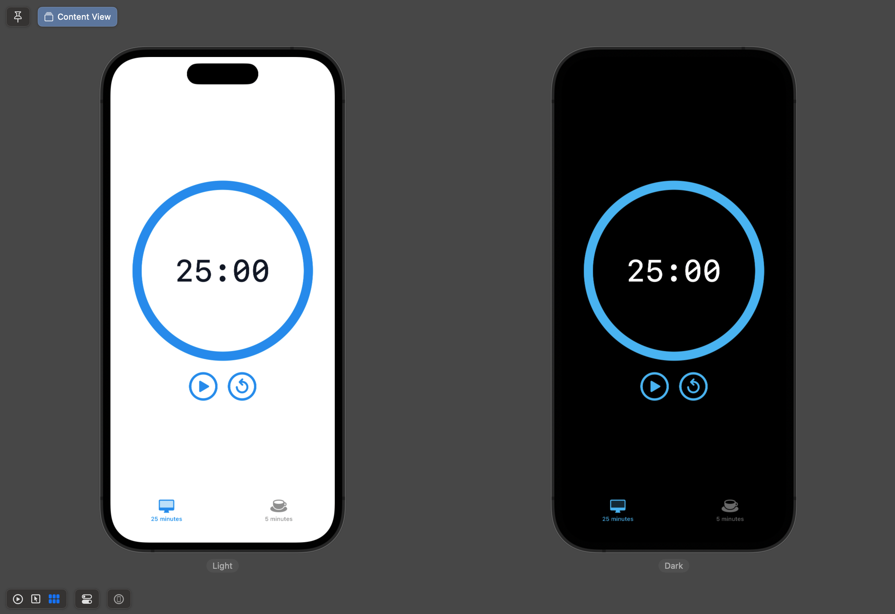

# pomodoro-timer

[ポモドーロテクニック](https://ja.wikipedia.org/wiki/%E3%83%9D%E3%83%A2%E3%83%89%E3%83%BC%E3%83%AD%E3%83%BB%E3%83%86%E3%82%AF%E3%83%8B%E3%83%83%E3%82%AF)専用のシンプルなタイマーアプリ

## iPhone

## iPad

## Requirement
- Language: Swift
- Version: 5.8.1
- Xcode: 14.3.1
- Architecture: MVVM

## Reference
Resources/bell.mp3の音源は[OtoLogic](https://otologic.jp/free/license.html)から使わせていただきました.
